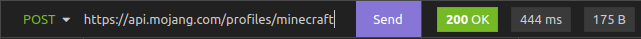
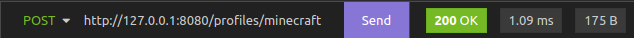

# :incoming_envelope: mojang-redis :incoming_envelope:
A Go microservice for the Mojang API, to serve responses faster and create REDIS caches for each request.

#### FROM 444ms


#### TO 1ms


## :whale: Quick start with Docker

```sh
git clone https://github.com/net32/mojang-redis.git
docker-compose up -d
```
## :memo: API Reference
Request are the same of [Mojang API](https://wiki.vg/Mojang_API)

### :pushpin: [Username to UUID](https://wiki.vg/Mojang_API#Username_to_UUID)
```http
GET /users/profiles/minecraft/${userName}
GET /users/profiles/minecraft/notch
```
| Parameter | Type     | Description                       |
| :-------- | :------- | :-------------------------------- |
| `userName`| `string` | **Required**. Username of player to fetch |
#### Response
```json
{
	"name": "Notch",
	"id": "069a79f444e94726a5befca90e38aaf5"
}
```
#
### :pushpin: [Usernames to UUIDs](https://wiki.vg/Mojang_API#Usernames_to_UUIDs)
```http
POST /profiles/minecraft
```
| Parameter | Type     | Description                       |
| :-------- | :------- | :-------------------------------- |
| `body`    | `json`   | **Required**. Json payload of userNames to fetch |
#### Body payload
```json
[
    "NeT32",
    "notch",
    "nonExistingPlayer"
]
```
#### Response
```json
[
	{
		"id": "c5870df744e9495f928a0e3e8703a03e",
		"name": "net32"
	},
	{
		"id": "069a79f444e94726a5befca90e38aaf5",
		"name": "Notch"
	}
]
```
#
### :pushpin: [UUID to Name History](https://wiki.vg/Mojang_API#UUID_to_Name_History)
```http
GET /user/profiles/${uuid}/names
GET /user/profiles/14f19f5050cb44cd9f0bbe906ad59753/names
```
| Parameter | Type     | Description                       |
| :-------- | :------- | :-------------------------------- |
| `uuid`    | `string` | **Required**. UUID of player to fetch |
#### Response
```json
[
	{
		"name": "HaloIsBae"
	},
	{
		"name": "BilboBeaver",
		"changedToAt": 1450912796000
	},
	{
		"name": "Bar",
		"changedToAt": 1495337426000
	}
]
```
#
### :pushpin: [UUID to Profile and Skin/Cape](https://wiki.vg/Mojang_API#UUID_to_Profile_and_Skin.2FCape)
```http
GET /session/minecraft/profile/${uuid}?unsigned=false
GET /session/minecraft/profile/069a79f444e94726a5befca90e38aaf5?unsigned=true
```
| Parameter | Type     | Description                       |
| :-------- | :------- | :-------------------------------- |
| `uuid`    | `string` | **Required**. UUID of player to fetch |
| `unsigned`| `boolean` | *Optional*. If need signature use false |
#### Response
```json
{
	"id": "069a79f444e94726a5befca90e38aaf5",
	"name": "Notch",
	"properties": [
		{
			"name": "textures",
			"value": "ewogICJ0aW1lc3RhbXAiIDogMTY0OTgxMjMzNzk2NywKICAicHJvZmlsZUlkIiA6ICIwNjlhNzlmNDQ0ZTk0NzI2YTViZWZjYTkwZTM4YWFmNSIsCiAgInByb2ZpbGVOYW1lIiA6ICJOb3RjaCIsCiAgInRleHR1cmVzIiA6IHsKICAgICJTS0lOIiA6IHsKICAgICAgInVybCIgOiAiaHR0cDovL3RleHR1cmVzLm1pbmVjcmFmdC5uZXQvdGV4dHVyZS8yOTIwMDlhNDkyNWI1OGYwMmM3N2RhZGMzZWNlZjA3ZWE0Yzc0NzJmNjRlMGZkYzMyY2U1NTIyNDg5MzYyNjgwIgogICAgfQogIH0KfQ=="
		}
	]
}
```
#
### :pushpin: [Blocked Servers](https://wiki.vg/Mojang_API#Blocked_Servers)
```http
GET /blockedservers
```
#### Response
A line-separated list of all SHA1 hashes.
```
d7aaeee640a82d97b182d237c46e6fe4c6d55fe3
fc14b4c345af53bd3a8566de92b71186432253cc
c5c03d9bad5c5ad25deb64600b9cd900312d4d74
72fd29f430c91c583bb7216fe673191dc25a7e18
```
